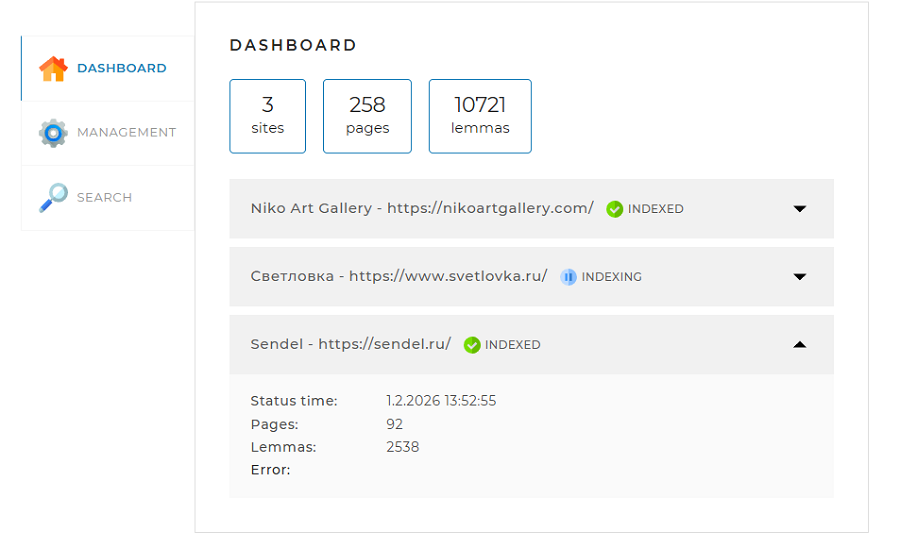
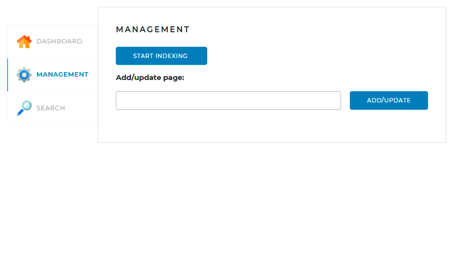
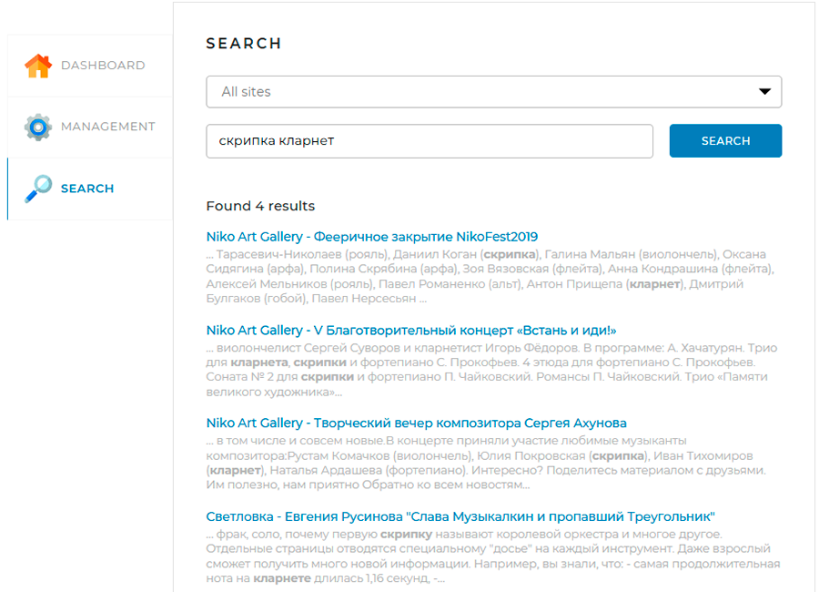

# Search Engine
## О проекте
Локальный поисковый движок для сайтов. Позволяет индексировать страницы,
сохранять леммы с учетом морфологии русского языка и выдавать
результаты поиска со сниппетами с учётом релевантности.

Проект представляет собой серверное приложение с веб-интерфейсом
для управления индексацией и выполнения поисковых запросов.
Проект выполнен в рамках учебного курса Skillbox.

**Используемые технологии:** Java 21, SpringBoot 3.4, MySQL, Liquibase,
Apache Lucene Morphology, Jsoup.

### Технические особенности
* **Многопоточная индексация** - с использованием *ForkJoinPool* для параллельного
обхода страниц сайта.
* **Морфологический анализ** - с использованием библиотек *Apache Lucene* для получения
исходных форм слов (лемм).
* **Генерация сниппетов** - реализован алгоритм поиска оптимального текствого окна на
основании количества попадающих в него лемм запроса и их кучности.

## Использование

Веб-интерфейс проекта представляет собой
одну веб-страницу с тремя вкладками:

* **Dashboard.** На этой вкладке отображается общая статистика
по всем сайтам, представленным в конфигурационном файле (см. 
ниже раздел *Конфигурация*), а также детальная статистика и
статус по каждому из сайтов.

  

* **Management.** На этой вкладке можно запустить полную 
индексацию (переиндексацию), а также добавить (обновить)
отдельную страницу по ссылке.

  

После запуска индексации, на этой же вкладке её можно
остановить.

  

* **Search.** На этой вкладке находится поле поиска и выпадающий
список с выбором сайта, по которому должен производиться поиск
  (возможен также поиск по всем сайтам). Результаты поиска 
выводятся при нажатии на кнопку "Search" в порядке уменьшения
их релевантности.
> Примечание - Поиск возможен только по сайтам, индексация которых
> завершена (на вкладке Dashboard статус INDEXED).

  

## Запуск проекта
### Требования
* Java 21
* Maven
* MySQL 8.0
### Особенности зависимостей
Для работы проекта используются библиотеки морфологического анализа, расположенные
в приватном репозитории Skillbox. Перед запуском проекта необходимо в файл settings.xml
добавить сервер skillbox-gitlab и токен доступа, а также убедиться, что в pom.xml
подключен репозиторий skillbox-gitlab.

Для работы с базой данных необходимо создать схему MySQL с именем *search_engine* (по
умолчанию). Таблицы базы данных создаются автоматически при первом запуске через
*Liquibase*.

После этого проект можно компилировать и запускать из среды разработки. Для работы 
с веб-интерфейсом необходимо ввести в адресной строке браузера http://localhost:8080/.

## Конфигурация
В файле *application.yaml*, находящемся в корне проекта, можно настроить
следующие значения:
* **server.port** - порт, на котором будет работать запущенное приложение
  (вводится в адресной строке браузера)
* **spring.datasource** - раздел настроек подключения к базе данных. Здесь
задаются *username* и *password* пользователя в MySQL; в свойстве *url* 
указывается путь к заранее созданной схеме (по умолчанию с названием *search_engine*).
* **indexing-settings.sites** - список сайтов для индексации: указывается их
url и название.
